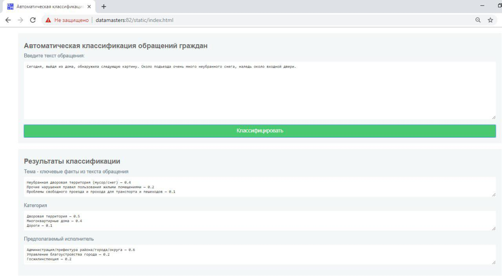

# Решение задачи "Автоматическая классификация обращений граждан"

Состав команды: Кварацхелия А.Г, Рахимов Д.Ф., Мангушева А.Р.

## Общее описание логики работы решения
* На основе документов тестового набора строится матрица расстояний с использованием word2wec [1] и Word Mover's Distance [2];    
* Для каждого нового документа расчитываем вектор расстояний от данного документа до каждого документа из обучающего набора.
* Применяем классификатор K-ближайших соседей с параметром количества соседей, равным 10-и.

[1] Tomas Mikolov, Kai Chen, Greg Corrado, Jeffrey Dean Efficient Estimation of Word Representations in Vector Space https://arxiv.org/abs/1301.3781

[2] Matt Kusner M, Yu Sun, Nicholas Kolkin, Kilian Weinberger "From Word Embeddings To Document Distances" http://mkusner.github.io/publications/WMD.pdf

Результаты

|        |   Категории   | Исполнители  |  Темы       |
| ------ |:-------------:|:------------:|------------:|
| Успех  | 1076 (60.2%)  | 1127 (63.0%) | 792 (44.3%) |
| Топ-3  |  411 (23.0%)  |  357 (20.0%) |  80 (15.7%) |
| Ошибка |  301 (16.8%)  |  304 (17.0%) | 716 (40.0%) |

## Требования к окружению для запуска продукта


Кроссплатформенное решение: Linux, Windows, macOS
Язык программирования: Python 3.6
Библиотеки и компоненты: NTLK, Gensim, RNNmorph (TensorFlow), Scikit-learn, семантические модели русского языка с 
https://rusvectores.org/ru/models/ (ruscorpora_upos_cbow_300_20_2019)


## Сценарий сборки и запуска проекта

[Установить docker](https://docs.docker.com/install/)

[Установить docker-compose](https://docs.docker.com/compose/install/)

Склонировать репозиторий

Перейти в корневую директорию репозитория

Скачать модель [ruscorpora_upos_cbow_300_20_2019 с rusvectores](http://vectors.nlpl.eu/repository/11/180.zip)
и распаковать содержащиеся файлы в поддиректорию classification-appeals/models/180

```
mkdir -p classification-appeals/models/180; wget http://vectors.nlpl.eu/repository/11/180.zip -O tmp.zip; unzip -o -d classification-appeals/models/180 tmp.zip; rm -rf tmp.zip
```

Собрать и запустить
```
docker-compose build
docker-compose up -d
```

Остановить
```
docker-compose down
```

Проверить можно, перейдя в браузере на `http://127.0.0.1`

## Примеры использования

### Программное решение

Работающее решение для тестирования находится по адресу http://104.238.128.209




### API сервиса

#### Запрос

```POST /classify```

#### Заголовки

```Content-Type: application/json```


#### Пример запроса

```
curl --request POST \
	--header "Content-Type: application/json" \
	--data '{"appeal_text":"Сегодня, выйдя из дома, обнаружила следующую картину. Около подъезда очень много неубранного снега, наледь около входной двери."}' \
	127.0.0.1/classify	
```

```
POST /classify HTTP/1.1
Accept: application/json
Accept-Encoding: gzip, deflate
Connection: keep-alive
Content-Length: 252
Content-Type:  application/json
Host: localhost
User-Agent: HTTPie/0.9.4

{
    "appeal_text": "Сегодня, выйдя из дома, обнаружила следующую картину. Около подъезда очень много неубранного снега, наледь около входной двери."
}
```

#### Пример ответа

```
HTTP/1.1 200 OK
Connection: keep-alive
Content-Length: 728
Content-Type: application/json
Date: Wed, 31 Jul 2019 11:10:42 GMT
Server: nginx/1.17.0

{
    "top3_categories": [
        [
            "Дворовая территория", 
            0.5
        ], 
        [
            "Многоквартирные дома", 
            0.4
        ], 
        [
            "Дороги", 
            0.1
        ]
    ], 
    "top3_executors": [
        [
            "Администрация/префектура района/города/округа", 
            0.6
        ], 
        [
            "Управление благоустройства города", 
            0.2
        ], 
        [
            "Госжилинспекция", 
            0.2
        ]
    ], 
    "top3_themes": [
        [
            "Неубранная дворовая территория (мусор/снег)", 
            0.4
        ], 
        [
            "Прочие нарушения правил пользования жилыми помещениями", 
            0.2
        ], 
        [
            "Проблемы свободного проезда и прохода для транспорта и пешеходов", 
            0.1
        ]
    ]
}
```